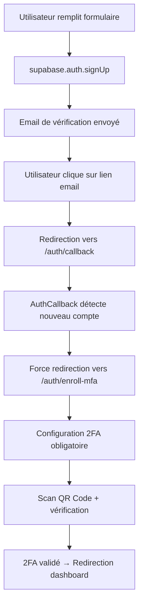

# 🔐 Nouveau Flux d'Authentification avec 2FA Obligatoire

## 🎯 **Objectif**

**TOUS les nouveaux comptes** (email + Google OAuth) doivent obligatoirement configurer la 2FA avant d'accéder à l'application, quel que soit leur rôle (patient ou nutritionniste).

## 🔄 **Flux d'Authentification Mis à Jour**

### 📧 **1. Création de Compte avec Email**



**Étapes détaillées :**

1. **Formulaire d'inscription** → `supabase.auth.signUp()` avec `emailRedirectTo: /auth/callback`
2. **Email envoyé** → Utilisateur reçoit un email avec lien de vérification
3. **Clic sur lien** → Redirection vers `/auth/callback` avec tokens
4. **AuthCallback** → Détecte nouveau compte via `isNewAccount()`
5. **Force 2FA** → Redirection automatique vers `/auth/enroll-mfa`
6. **Configuration 2FA** → QR Code + vérification obligatoire
7. **Accès autorisé** → Redirection vers dashboard

### 🔗 **2. Connexion avec Google OAuth**

```mermaid
graph TD
    A[Utilisateur clique "Google"] --> B[supabase.auth.signInWithOAuth]
    B --> C[Authentification Google]
    C --> D[Retour vers /auth/callback]
    D --> E[AuthCallback détecte nouveau compte]
    E --> F[Force redirection vers /auth/enroll-mfa]
    F --> G[Configuration 2FA obligatoire]
    G --> H[Scan QR Code + vérification]
    H --> I[2FA validé → Redirection dashboard]
```

**Étapes détaillées :**

1. **Clic bouton Google** → `supabase.auth.signInWithOAuth()` avec `redirectTo: /auth/callback`
2. **OAuth Google** → Authentification sur Google
3. **Retour app** → Redirection vers `/auth/callback` avec tokens
4. **AuthCallback** → Détecte nouveau compte via `isNewAccount()`
5. **Force 2FA** → Redirection automatique vers `/auth/enroll-mfa`
6. **Configuration 2FA** → QR Code + vérification obligatoire
7. **Accès autorisé** → Redirection vers dashboard

## 🧠 **Logique de Détection de Nouveau Compte**

### 📋 **Fonction `isNewAccount()` (AuthCallback.tsx)**

```typescript
const isNewAccount = async (user: any) => {
  const { data: profileData } = await supabase
    .from('profiles')
    .select('created_at, two_factor_enabled, last_sign_in_at')
    .eq('id', user.id)
    .single();

  if (!profileData) return true; // Profil pas encore créé

  const accountAge = Date.now() - new Date(profileData.created_at).getTime();
  const isRecentAccount = accountAge < 10 * 60 * 1000; // 10 minutes
  const isFirstSignIn = !profileData.last_sign_in_at;
  const no2FAConfigured = !profileData.two_factor_enabled;

  // C'est un nouveau compte si : récent OU première connexion OU pas de 2FA
  return isRecentAccount || isFirstSignIn || no2FAConfigured;
};
```

### 🔍 **Critères de Nouveau Compte (LOGIQUE CORRIGÉE)**

**PRIORITÉ ABSOLUE** : Si `two_factor_enabled === true`, alors ce n'est **PAS** un nouveau compte.

Un compte est considéré comme "nouveau" si :

1. **Profil inexistant** → `profileData === null`
2. **2FA non configuré** → `two_factor_enabled === false` ET au moins une des conditions :
   - **Compte récent** → Créé il y a moins de 10 minutes
   - **Première connexion** → `last_sign_in_at === null`

```typescript
// LOGIQUE CORRIGÉE
if (profileData.two_factor_enabled === true) {
  return false; // ✅ 2FA configuré = compte existant
}

// Sinon, vérifier les autres critères
return isRecentAccount || isFirstSignIn || no2FAConfigured;
```

## 🛠️ **Modifications Techniques**

### 📄 **Fichiers Modifiés**

#### 1. **`src/components/auth/AuthCallback.tsx`**

- ✅ Ajout fonction `isNewAccount()`
- ✅ Modification `handleMFARedirection()` avec priorité nouveau compte
- ✅ Force redirection `/auth/enroll-mfa` pour nouveaux comptes

#### 2. **`src/components/auth/AuthForms.tsx`**

- ✅ Ajout fonction `checkIfNewAccount()`
- ✅ Modification logique connexion email/password
- ✅ Force redirection `/auth/enroll-mfa` pour nouveaux comptes

#### 3. **`src/lib/supabase.ts`**

- ✅ `emailRedirectTo` configuré sur `/auth/callback`

### 🔄 **Ordre de Priorité dans la Redirection**

```typescript
// PRIORITÉ 1: Nouveau compte → Force 2FA
if (await isNewAccount(user)) {
  router.push('/auth/enroll-mfa');
  return;
}

// PRIORITÉ 2: Compte existant → Vérifier AAL
const { currentLevel, nextLevel } = await getAAL();
// ... logique AAL existante
```

## 🧪 **Tests**

### 📋 **Page de Test : `/test-new-account-flow`**

**Fonctionnalités :**

- ✅ Test création compte email avec rôle sélectionnable
- ✅ Test OAuth Google
- ✅ Vérification utilisateur actuel
- ✅ Déconnexion
- ✅ Logs détaillés dans la console

### 🔍 **Scénarios de Test**

#### **Scénario 1 : Nouveau Compte Email**

1. Aller sur `/test-new-account-flow`
2. Remplir email + mot de passe + rôle
3. Cliquer "Créer Compte Email"
4. Vérifier email → Cliquer lien
5. **Attendu** : Redirection automatique vers `/auth/enroll-mfa`

#### **Scénario 2 : Nouveau Compte Google**

1. Aller sur `/test-new-account-flow`
2. Cliquer "Test OAuth Google"
3. S'authentifier avec Google (nouveau compte)
4. **Attendu** : Redirection automatique vers `/auth/enroll-mfa`

#### **Scénario 3 : Compte Existant**

1. Se connecter avec compte existant (déjà 2FA configuré)
2. **Attendu** : Redirection normale vers dashboard

## 📊 **Logs de Debug**

### 🔍 **Console Logs Disponibles**

```javascript
// AuthCallback.tsx
console.log('🔍 Analyse nouveau compte:', {
  userId, userEmail, accountAge, isRecentAccount,
  isFirstSignIn, no2FAConfigured
});

console.log('🆕 NOUVEAU COMPTE DÉTECTÉ - Redirection obligatoire vers 2FA');

// AuthForms.tsx
console.log('🔍 AuthForms - Analyse nouveau compte:', { ... });
console.log('🆕 NOUVEAU COMPTE DÉTECTÉ - Redirection obligatoire vers 2FA');
```

## ✅ **Vérifications de Fonctionnement**

### 🎯 **Points de Contrôle**

1. **Email de vérification** → Lien pointe vers `/auth/callback`
2. **OAuth Google** → `redirectTo` configuré sur `/auth/callback`
3. **AuthCallback** → Détecte correctement les nouveaux comptes
4. **Redirection forcée** → Tous nouveaux comptes vont vers `/auth/enroll-mfa`
5. **2FA obligatoire** → Impossible de contourner la configuration
6. **Comptes existants** → Logique AAL normale maintenue

### 🚨 **Signaux d'Alerte**

- ❌ Nouveau compte redirigé vers dashboard sans 2FA
- ❌ Compte existant bloqué en boucle sur 2FA
- ❌ Erreurs dans les logs de détection de nouveau compte
- ❌ OAuth ne redirige pas vers `/auth/callback`

## 🔧 **Dépannage**

### 🛠️ **Page de Debug : `/debug-auth-flow`**

**Fonctionnalités :**

- ✅ Analyse complète de l'utilisateur actuel
- ✅ Simulation de la logique AuthCallback
- ✅ Vérification des critères de nouveau compte
- ✅ Diagnostic des redirections attendues
- ✅ Logs détaillés de tous les paramètres

**Utilisation :**

1. Se connecter avec le compte à analyser
2. Aller sur `/debug-auth-flow`
3. Cliquer "Analyser Utilisateur Actuel"
4. Vérifier les résultats dans le JSON affiché

### 🐛 **Problèmes Courants**

#### **Problème 1 : Nouveau compte ne va pas vers 2FA**

```javascript
// Vérifier dans la console :
console.log('🔍 Analyse nouveau compte:', { ... });
// Si pas affiché → Fonction isNewAccount() pas appelée
```

#### **Problème 2 : Compte existant bloqué sur 2FA**

```javascript
// Vérifier les critères de nouveau compte :
// accountAge, isFirstSignIn, no2FAConfigured
```

#### **Problème 3 : OAuth ne fonctionne pas**

```javascript
// Vérifier redirectTo dans signInWithOAuth :
redirectTo: `${window.location.origin}/auth/callback`;
```

---

## 🎉 **Résultat Final**

**Sécurité renforcée** : Tous les nouveaux utilisateurs (patients + nutritionnistes) configurent obligatoirement la 2FA dès leur première connexion, sans exception possible.
